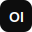

# CSOAI - Council of AIs

<div align="center">



**The West's Answer to TC260 - AI Safety Governance for Humanity**

[](https://opensource.org/licenses/MIT)
[](CONTRIBUTING.md)

[Demo](https://coai.safetyof.ai) · [Documentation](docs/) · [Report Bug](issues) · [Request Feature](issues)

</div>

---

## 🌍 The Problem

By **August 2026**, the EU AI Act becomes fully enforceable. Companies face:
- **€35 million fines** or 7% of global revenue for non-compliance
- No unified Western framework equivalent to China's TC260
- Fragmented guidance across EU AI Act, NIST AI RMF, and national regulations
- No public accountability mechanism for AI safety

## 💡 The Solution

**CSOAI (Council of AIs)** is an open-source AI safety governance platform that:

1. **Unifies compliance** across EU AI Act, NIST AI RMF, TC260, and other frameworks
2. **Automates assessment** using a 33-agent council with Byzantine fault tolerance
3. **Creates jobs** through the Watchdog Analyst program (human-in-the-loop)
4. **Ensures transparency** via public incident reporting and accountability

---

## 🏗️ Architecture

```
┌─────────────────────────────────────────────────────────────┐
│                         CSOAI                                 │
├─────────────────────────────────────────────────────────────┤
│  ┌─────────────┐  ┌─────────────┐  ┌─────────────┐         │
│  │  SOAI-PDCA  │  │  33-Agent   │  │  Watchdog   │         │
│  │  Loop       │  │  Council    │  │  Portal     │         │
│  │             │  │             │  │             │         │
│  │  Plan→Do→   │  │  Guardian   │  │  Public     │         │
│  │  Check→Act  │  │  Arbiter    │  │  Reports    │         │
│  │             │  │  Scribe     │  │  LOI Jobs   │         │
│  └─────────────┘  └─────────────┘  └─────────────┘         │
├─────────────────────────────────────────────────────────────┤
│                    Compliance Engine                         │
│  ┌──────────┐  ┌──────────┐  ┌──────────┐  ┌──────────┐    │
│  │ EU AI Act│  │ NIST RMF │  │  TC260   │  │  Others  │    │
│  └──────────┘  └──────────┘  └──────────┘  └──────────┘    │
└─────────────────────────────────────────────────────────────┘
```

---

## 🚀 Features

### For Organizations (B2B/B2G)
- **Multi-Framework Compliance**: Track compliance across EU AI Act, NIST, TC260
- **Risk Assessment**: Automated AI system risk classification
- **33-Agent Council**: Byzantine fault-tolerant voting for compliance decisions
- **PDCA Integration**: Continuous improvement loop for AI governance
- **Audit Trail**: Complete documentation for regulatory submissions

### For the Public (B2C via SOAI)
- **Incident Reporting**: Report AI safety concerns publicly
- **Watchdog Jobs**: Earn money auditing AI systems from home
- **Training & Certification**: Become a certified Watchdog Analyst
- **Leaderboard**: Track top contributors to AI safety

---

## 🛠️ Tech Stack

| Layer | Technology |
|-------|------------|
| Frontend | React 19, TypeScript, TailwindCSS 4, shadcn/ui |
| Backend | Node.js, tRPC, Express |
| Database | MySQL/TiDB via Drizzle ORM |
| AI | Multi-LLM (OpenAI, Anthropic, Google) |
| Auth | Manus OAuth |
| Hosting | Manus Platform |

---

## 📦 Installation

### Prerequisites
- Node.js 22+
- pnpm 10+
- MySQL 8+ or TiDB

### Quick Start

```bash
# Clone the repository
git clone https://github.com/coai-safety/csoai-dashboard.git
cd csoai-dashboard

# Install dependencies
pnpm install

# Set up environment variables
cp .env.example .env
# Edit .env with your database credentials and API keys

# Push database schema
pnpm db:push

# Seed training content
node scripts/seed-training.mjs

# Start development server
pnpm dev
```

---

## 📊 Database Schema

CSOAI uses 23 tables organized into functional groups:

### Core Tables
- `users` - User accounts with roles
- `organizations` - B2B customer organizations
- `ai_systems` - Registered AI systems

### Compliance Tables
- `frameworks` - Supported compliance frameworks
- `requirements` - Framework requirements
- `assessments` - Compliance assessments
- `assessment_items` - Individual requirement status

### Watchdog Tables
- `watchdog_reports` - Public incident reports
- `watchdog_comments` - Report discussions
- `watchdog_applications` - LOI collection

### Council Tables
- `council_sessions` - 33-agent voting sessions
- `agent_votes` - Individual agent votes

### Training Tables
- `training_modules` - Course content
- `user_training_progress` - Completion tracking
- `certification_tests` - Test definitions
- `test_questions` - Exam questions
- `user_test_attempts` - Test history
- `user_certificates` - Issued certificates

### Workbench Tables
- `case_assignments` - Analyst workload
- `analyst_decisions` - Review outcomes
- `analyst_performance` - Stats and rankings

---

## 🤝 The Watchdog Program

### Become a Watchdog Analyst

1. **Sign Up**: Express interest via the LOI form
2. **Train**: Complete 5 self-paced training modules
3. **Certify**: Pass the 50-question certification exam (70% to pass)
4. **Work**: Review AI safety cases from home
5. **Earn**: Get paid for your contributions

### Why This Matters

- Creates **real jobs** in AI safety
- Ensures **human oversight** of AI decisions
- Builds **public trust** through transparency
- Provides **ground truth** for improving AI

---

## 🔐 The 33-Agent Council

Our Byzantine fault-tolerant voting system uses 33 AI agents:

| Role | Count | Focus |
|------|-------|-------|
| Guardian | 11 | Safety, Security, Privacy |
| Arbiter | 11 | Fairness, Transparency, Accountability |
| Scribe | 11 | Documentation, Compliance, Reporting |

**Consensus Requirement**: 22/33 (2/3 majority) for automated decisions. When consensus isn't reached, cases escalate to human Watchdog Analysts.

---

## 📈 Roadmap

### Phase 1: Foundation ✅
- [x] Multi-framework compliance engine
- [x] 33-agent council with Byzantine fault tolerance
- [x] Watchdog portal and LOI collection
- [x] Training and certification system
- [x] Analyst workbench

### Phase 2: Scale (Q1 2026)
- [ ] Real-time LLM voting integration
- [ ] Advanced analytics dashboard
- [ ] API for third-party integrations
- [ ] Mobile app for analysts

### Phase 3: Ecosystem (Q2 2026)
- [ ] SOAI browser extension
- [ ] Public API marketplace
- [ ] Enterprise SSO integration
- [ ] Multi-language support

---

## 🤝 Contributing

We welcome contributions! See [CONTRIBUTING.md](CONTRIBUTING.md) for guidelines.

### Ways to Contribute
- 🐛 Report bugs
- 💡 Suggest features
- 📝 Improve documentation
- 🔧 Submit pull requests
- 🌍 Translate content

---

## 📄 License

This project is licensed under the MIT License - see [LICENSE](LICENSE) for details.

---

## 🙏 Acknowledgments

- **TC260** - For pioneering AI safety governance in China
- **NIST** - For the AI Risk Management Framework
- **EU Commission** - For the AI Act
- **Open WebUI** - For design inspiration
- **The Manus Team** - For the development platform

---

## 📞 Contact

- **Website**: [safetyof.ai](https://safetyof.ai)
- **Email**: hello@safetyof.ai
- **Twitter**: [@CSOAISafety](https://twitter.com/CSOAISafety)

---

<div align="center">

**Built for Humanity. Open Source Forever.**

⭐ Star this repo if you believe in AI safety!

</div>
