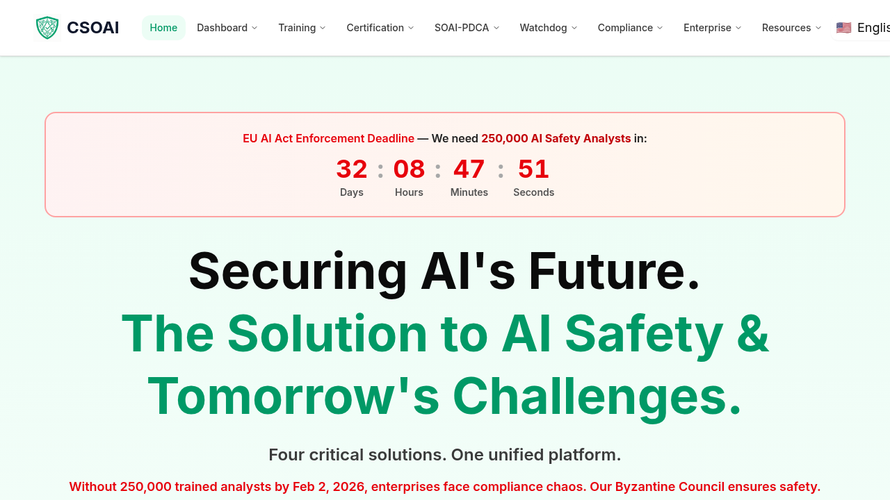

# How to Get Certified as an AI Safety Analyst

This guide walks you through the complete process of becoming a CEASAI-certified AI Safety Analyst.

## Overview

The CEASAI certification program trains you to become a professional AI Safety Analyst. Upon completion, you'll be qualified to:

- Review AI systems for compliance with EU AI Act, NIST AI RMF, and ISO 42001
- Earn $45-150/hour working remotely
- Join the global network of AI safety professionals

## Step 1: Create Your Account

1. Visit [csoai.org](https://csoai.org)
2. Click **"Get Started Free"** or **"Sign Up"** in the navigation
3. Enter your email and create a password
4. Verify your email address

## Step 2: Complete the Training Modules

The training consists of 5 comprehensive modules (~4 hours total):

### Module 1: Introduction to AI Safety
- Why AI safety matters
- Major AI incidents and risks
- The role of Watchdog Analysts

### Module 2: Understanding the EU AI Act
- Four risk categories (unacceptable, high, limited, minimal)
- Compliance requirements
- Penalties up to €35M

### Module 3: NIST AI Risk Management Framework
- Four core functions: Govern, Map, Measure, Manage
- Risk assessment methodologies
- Enterprise application

### Module 4: Identifying AI Bias and Fairness Issues
- Types of bias (data, algorithmic, deployment)
- Fairness metrics
- Real-world case studies

### Module 5: Making Decisions as a Watchdog Analyst
- Decision-making framework
- Writing clear safety reports
- Working with the 33-Agent Council

**To access training:**
1. Log into your dashboard
2. Navigate to **Training** in the sidebar
3. Click **"Start Module 1"**
4. Complete each module in order

## Step 3: Take the Certification Exam

Once you've completed all 5 training modules, you're eligible to take the certification exam.

### Exam Details:
- **Questions:** 50 multiple-choice
- **Duration:** 90 minutes
- **Passing Score:** 70% (35/50 correct)
- **Retakes:** Unlimited (24-hour wait between attempts)

### Topics Covered:
| Topic | Weight |
|-------|--------|
| AI Safety Fundamentals | 20% |
| EU AI Act | 25% |
| NIST AI RMF | 25% |
| AI Bias & Fairness | 15% |
| Analyst Decision-Making | 15% |

**To take the exam:**
1. Navigate to **Certification** in the sidebar
2. Click **"Start Exam"**
3. Answer all 50 questions
4. Submit before the timer expires

## Step 4: Receive Your Certificate

Upon passing the exam, you'll immediately receive:

1. **Digital Certificate** - PDF with unique verification ID
2. **QR Code** - Scannable verification link
3. **LinkedIn Badge** - Shareable credential

### Certificate Features:
- CEASAI and CSOAI dual branding
- Accreditation badges (EU AI Act, NIST AI RMF, ISO 42001, TC260)
- Unique certificate ID for verification
- Valid for 1 year (renewable)

**To download your certificate:**
1. Navigate to **My Certificates** in the sidebar
2. Click **"Download PDF"**
3. Share on LinkedIn or add to your resume

## Step 5: Start Earning

After certification, you can:

### Option A: Watchdog Analyst Work
- Review AI safety reports submitted by the public
- Earn per report reviewed
- Work through the Analyst Workbench

### Option B: Enterprise Consulting
- Help companies achieve EU AI Act compliance
- Conduct NIST AI RMF assessments
- Implement ISO 42001 frameworks

### Option C: Referral Program
- Earn 20% commission on referrals
- Share your unique referral link
- Track earnings in your dashboard

## Frequently Asked Questions

**Q: Do I need technical experience?**
A: No. The training covers everything you need. Critical thinking skills are more important than coding.

**Q: How long does certification take?**
A: Most people complete training in 4-8 hours and pass the exam on their first attempt.

**Q: Is the certificate recognized?**
A: Yes. CEASAI certification is recognized by enterprises and governments as proof of AI safety expertise.

**Q: What if I fail the exam?**
A: You can retake the exam after 24 hours. Unlimited attempts are allowed.

**Q: How do I renew my certification?**
A: Certifications are valid for 1 year. Renewal requires passing an updated exam.

## Support

Need help? Contact us:
- Email: support@csoai.org
- Help Center: [csoai.org/help](https://csoai.org/help)

---

*CEASAI - Certified Enterprise AI Safety Institute*
*In partnership with CSOAI - Council for Safety Oversight of AI*
